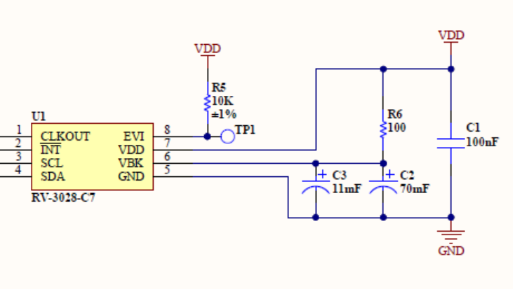

# RAK4631_RAK12500_RAK12002_OLED

Demo code for WisBlock with Wisblock OLED, GNSS and [RTC](https://store.rakwireless.com/products/rtc-module-rak12002?variant=40102983598278) modules.

At the heart of the RTC module is an [RV-3028 C7 Real-Time Clock Module](https://www.microcrystal.com/en/products/real-time-clock-rtc-modules/rv-3028-c7/), which is optimized for extreme low power consumption. It has a wide operating voltage range, 1.1 to 5.5 V, and uses the I²C bus interface at 400 kHz. It has a lofty 43 bytes (!!!) of non-volatile user memory, which could be used to save basic settings, without having to add an EEPROM. Perfect for IoT and low-power requirements.

We'll be using the [RV-3028 C7 Arduino Library](https://github.com/constiko/RV-3028_C7-Arduino_Library), which has a rich API that reflects the capabilities of the RTC module. One thing of note is the trickle charging circuit, which allows a battery or super-capacitor connected to the VBACKUP pin to be charged from the power supply connected to the VDD pin. We took full advantage of that: in the schematics below, you can see that we have 2 super-capacitors, C2 and C3, connected to VBAK. By default it uses C2 at 70 mF/3.3 V. C3, at 11 mF/3.3 V is reserved. The library has two functions for this:

```c
enableTrickleCharge(uint8_t tcr = TCR_15K)
disableTrickleCharge()
```

Values for `enableTrickleCharge` are:

* `TCR_3K` for 3k Ohm
* `TCR_5K` for 5k Ohm
* `TCR_9K` for 9k Ohm
* `TCR_15K` for 15k Ohm

<center>



<i>The Trickle Charger</i>
</center>

In real-life tests, we were able to squeeze 7 days out of the C2 super-capacitor, no pill battery required! That's quite good for such a small module.

## Time functions

### General functions

* begin()
* reset()
* set12Hour()
* set24Hour()
* is12Hour()
* isPM()

### Setting the time

* setTime(sec, min, hour, weekday, date, month, year)
* setSeconds(value)
* setMinutes(value)
* setHours(value)
* setWeekday(value)
* setDate(value)
* setMonth(value)
* setYear(value)
* setToCompilerTime()
* setUNIX(value)

### Getting the time

* updateTime() --> Must be called first!
* getSeconds()
* getMinutes()
* getHours()
* getWeekday()
* getDate()
* getMonth()
* getYear()
* stringDateUSA()
* stringDate()
* stringTime()
* stringTimeStamp()
* getUNIX()

There are a few more functions, but this is already quite enough for our purpose.

`setTime` returns a boolean lettings us know whether things went well:

```c
if (rtc.setTime(
    g_myGNSS.getSecond(), g_myGNSS.getMinute(), g_myGNSS.getHour(), g_myGNSS.getDay(),
    g_myGNSS.getTimeOfWeek(), g_myGNSS.getMonth(), g_myGNSS.getYear()) == false) {
  Serial.println("Something went wrong setting the time");
}
```

Checking the RTC time and comparing it with the GNSS time is easy:

```c
rtc.updateTime();
if (rtc.getMinutes() != g_myGNSS.getMinute() || g_myGNSS.getHour() != rtc.getHours()) {
  Serial.println("Readjusting RTC");
  if (rtc.setTime(
        g_myGNSS.getSecond(), g_myGNSS.getMinute(), g_myGNSS.getHour(), g_myGNSS.getDay(),
        g_myGNSS.getTimeOfWeek(), g_myGNSS.getMonth(), g_myGNSS.getYear()) == false
     ) {
    Serial.println(" . Something went wrong setting the time");
  }
}
```

As you can see, one version (GNSS) uses the singular forms (`getMinute()`, `getHour()`), whereas the other uses the plural (`getMinutes()`, `getHours()`). A bit confusing. I am half tempted to unify everything and update one of the libraries so that they match...

### UNIX Time Counter

The UNIX Time Counter is a 32-bit counter, unsigned integer: it rolls over to 00000000h when reaching
FFFFFFFFh. The 4 bytes (UNIX Time 0 to UNIX Time 3) are fully readable and writable. The counter source clock is the digitally-offset, compensated 1 Hz tick.

The UNIX Time Counter is independent from the RTC, and has some pecularities.

During I2C write access with an access time smaller than 950 ms, the UNIX Time 0 to UNIX Time 3 registers are blocked. Unlike setting the clock and calendar registers, after I2C STOP, a 1-Hz tick can be lost. If the I2C write access takes longer than 950 ms the I2C bus interface is reset by the internal bus timeout function. It is recommended to make a reset of the prescaler before setting the UNIX time(*). The 32-bit UNIX counter value itself does not change during reset.

#### (*) RESET BIT FUNCTION
```c
// Bits in Control2 Register
[...]
#define CTRL2_RESET 0

[...]

void RV3028::reset() {
  setBit(RV3028_CTRL2, CTRL2_RESET);
}
```
